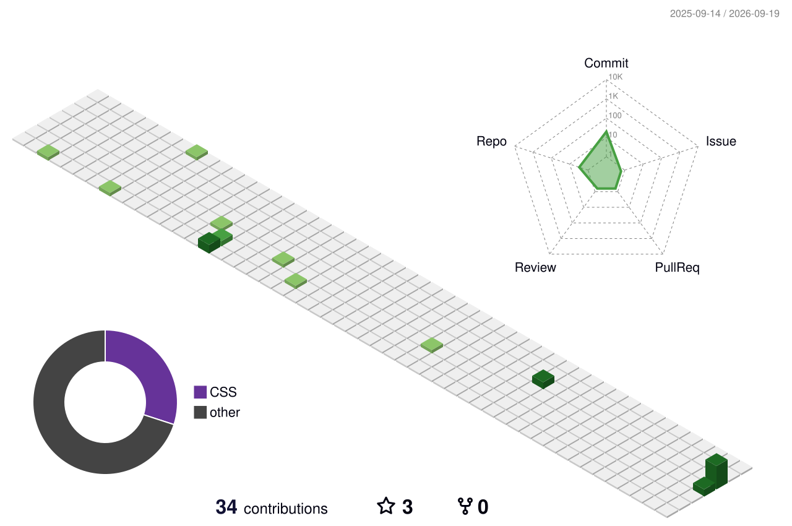

 

<h1 align="center">Hi 👋, I'm Shagun Sharma</h1>
<h3 align="center">A passionate 
  Full stack web developer 🖥</h3>
  

  

* 🎓 Completed the **Full Stack Web Development Program at Masai School**

* 📫 Reach me at **[shagun08081999@gmail.com](mailto:shagun08081999@gmail.com)**

* ⚡ **“If you don’t risk anything, you risk even more.”**

 
<!-- Social & Professional Links -->

<!-- Resume -->

<!-- LinkedIn -->

<!-- Portfolio -->

<!-- Email -->

 

  

## 🛠 My Toolkit :

&nbsp;
&nbsp;

 

## 🔥 GitHub Contributions
<!--  -->
<!--  -->
 

